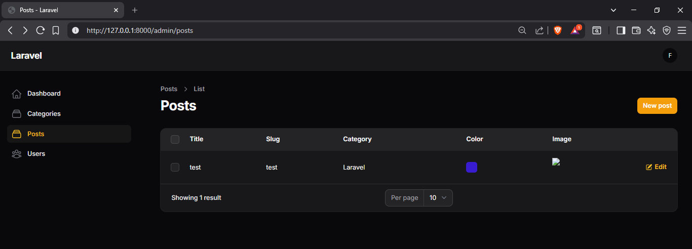
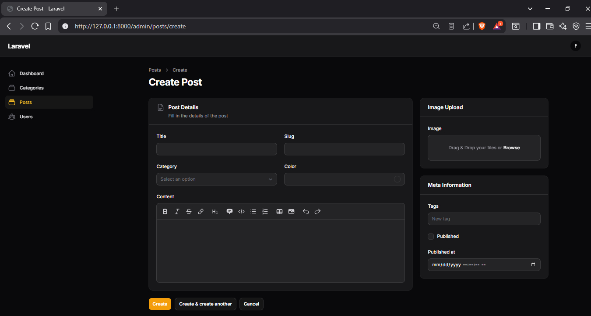
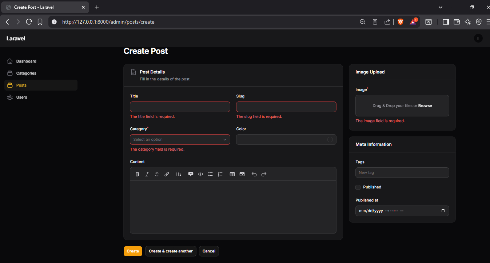

# Jobsheet 6
## Mata Kuliah: Pemrograman Web Lanjut

Dokumentasi ini berisi rangkuman percobaan 6-1, 6-2, dan 6-3 pada proyek Filament App. Isi dokumentasi menjelaskan langkah yang dilakukan, alasan perubahan, serta analisis dan diskusi dari tiap percobaan.

* **Nama:** Muhammad Febriansyah
* **NIM:** 244107020199
* **Kelas:** TI-2F

## Percobaan 6-1 - Membuat Form Post Resource

Pada percobaan ini saya membuat form dasar untuk entitas Post di Filament Resource. Komponen yang digunakan antara lain:
- `TextInput` untuk judul dan slug
- `Select` untuk memilih kategori melalui relasi `category`
- `ColorPicker` untuk memilih warna
- `MarkdownEditor` untuk isi konten
- `FileUpload` untuk gambar post
- `TagsInput` untuk tag
- `Checkbox` untuk status publish
- `DateTimePicker` untuk tanggal publikasi

Form juga dibagi menjadi beberapa section agar tampil lebih rapi, yaitu bagian Post Details, Image Upload, dan Meta Information.

### Analisis & Diskusi

1.Mengapa kita perlu storage:link? Agar file (seperti gambar) yang disimpan di dalam folder storage/app/public (yang bersifat privat) dapat diakses oleh browser melalui folder public/storage. Perintah ini membuat "jalan pintas" (symbolic link).

2.Apa fungsi $casts untuk field JSON/Array (seperti tags)? Fungsinya adalah mengubah format data secara otomatis. Data tags yang dikirim dari form berupa array, sedangkan database menyimpannya sebagai string/text. $casts memastikan data dikonversi menjadi array saat dibaca oleh PHP.

3.Mengapa kita menggunakan category.name bukan category_id pada tabel? Agar tabel lebih mudah dibaca oleh admin (menampilkan nama kategori seperti "Berita"), bukan sekadar angka ID (seperti "1") yang tidak memiliki makna visual.

4.Apa perbedaan RichEditor dan MarkdownEditor? RichEditor menghasilkan output HTML (WYSIWYG), sedangkan MarkdownEditor menghasilkan output format teks Markdown yang lebih ringan dan konsisten untuk diformat ulang.

### Hasil Akhir

---

## Percobaan 6-2 - Memperbaiki Error dan Struktur Layout

Pada percobaan ini saya memperbaiki beberapa error yang muncul saat resource dijalankan, seperti import class yang belum benar dan namespace komponen yang tidak sesuai. Perbaikan yang dilakukan antara lain:
- Menambahkan import `TextInput`
- Mengganti komponen `Markdown` menjadi `MarkdownEditor`
- Memperbaiki import `Group` ke namespace `Filament\Forms\Components\Group`
- Membersihkan import yang tidak dipakai agar tidak menimbulkan konflik

Selain itu, struktur layout form juga dirapikan dengan `Section` dan `Group` supaya tampilannya lebih sesuai dengan desain yang diinginkan.

### Analisis & Diskusi

1.Mengapa layout form penting dalam aplikasi admin? Untuk meningkatkan pengalaman pengguna (UX). Form yang rapi dan terkelompok membuat admin lebih cepat menginput data tanpa merasa kewalahan dengan banyaknya field yang menumpuk.

2.Apa perbedaan Section dan Group? Section memiliki tampilan visual (kotak/card, judul, deskripsi, dan bisa di-collapse), sedangkan Group hanya berfungsi sebagai pembungkus logika layout (seperti 
 di HTML) tanpa garis tepi atau judul.

3.Kapan kita menggunakan columnSpanFull()? Digunakan saat sebuah field (seperti MarkdownEditor atau Textarea) memerlukan lebar penuh (100%) dari container-nya agar area pengetikan lebih luas.

4.Apa keuntungan sistem grid 12 kolom? Memberikan fleksibilitas tinggi dalam mengatur proporsi. Kita bisa membagi layout menjadi (6-6), (8-4), atau (4-4-4) dengan sangat presisi.
### Hasil Akhir

---

## Percobaan 6-3 - Menampilkan Data pada Tabel

Pada percobaan ini saya menambahkan kolom-kolom pada method `table()` supaya data Post bisa tampil di daftar tabel admin. Kolom yang ditambahkan adalah:
- `TextColumn::make('title')`
- `TextColumn::make('slug')`
- `TextColumn::make('category.name')`
- `ColorColumn::make('color')`
- `ImageColumn::make('image')->disk('public')`

Dengan kolom ini, data yang sebelumnya hanya bisa diinput sekarang bisa ditampilkan dengan lebih informatif pada halaman list post.

### Analisis & Diskusi

1.Mengapa validasi penting pada admin panel? Untuk menjaga integritas data. Validasi mencegah data rusak (seperti email salah format), data duplikat (slug), atau field kosong yang seharusnya wajib diisi agar aplikasi tidak error.

2.Apa perbedaan validasi client-side dan server-side? Client-side terjadi di browser (cepat, memberi tahu user sebelum submit). Server-side (oleh Laravel) terjadi di server (lebih aman, sebagai pertahanan terakhir jika user mencoba membypass browser). Filament melakukan keduanya.

3.Mengapa unique otomatis bekerja saat edit data? Karena kita menggunakan parameter ignoreRecord: true. Ini memberi tahu Laravel untuk mengecek keunikan slug di seluruh tabel, kecuali untuk baris yang sedang kita edit saat ini.

4.Kapan kita perlu menggunakan rules array dibanding string? Rules array (['required', 'min:5']) lebih disarankan saat aturan validasi sangat kompleks atau melibatkan objek validasi kustom, sedangkan string ('required|min:5') lebih simpel untuk aturan dasar.

### Hasil Akhir

---

## Kesimpulan

Dari ketiga percobaan, dapat disimpulkan bahwa Filament sangat membantu dalam membangun admin panel Laravel dengan cepat. Form dapat disusun secara modular, error namespace dapat diperbaiki dengan import yang tepat, dan data dapat ditampilkan di tabel dengan komponen bawaan Filament.

