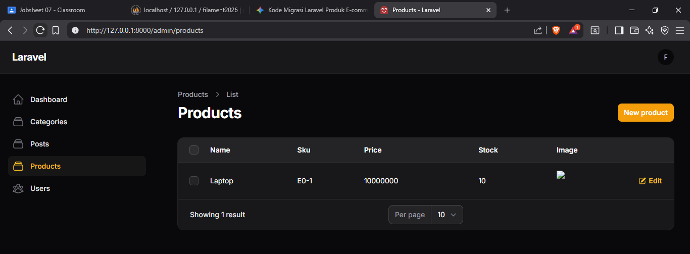
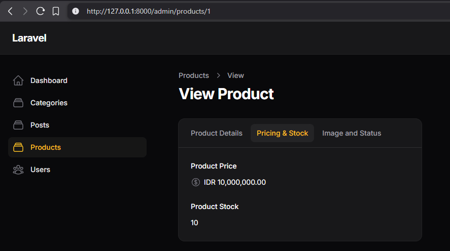
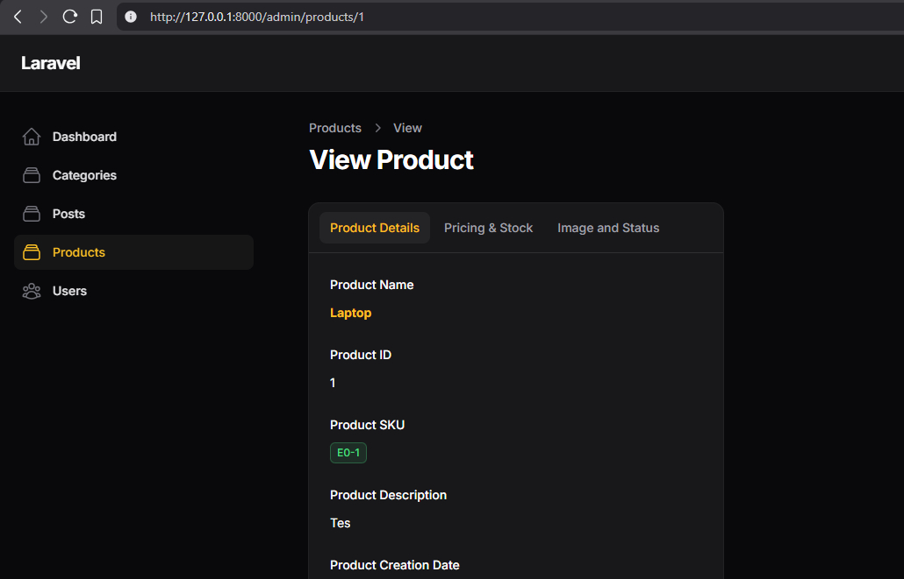

# Dokumentasi Jobsheet Filament App

Dokumentasi ini berisi rangkuman Jobsheet 7, 8, dan 9 pada project Filament App. Susunannya dibuat berurutan sesuai materi: multistep form, infolist untuk view page, dan tabs pada detail view. Setiap jobsheet disertai langkah-langkah, analisis & diskusi, serta halaman khusus untuk gambar hasil akhir.

- Nama: Muhammad Febriansyah
- NIM: 244107020199
- Kelas: TI-2F
- Mata Kuliah: Pemrograman Web Lanjut

## Struktur Jobsheet

1. Jobsheet 7 - Multistep Form
2. Jobsheet 8 - Infolist Element for View Page
3. Jobsheet 9 - Tabs in Details Deep Dive

---

## Jobsheet 7 - Multistep Form

Jobsheet ini membahas pembuatan form bertahap atau multistep form pada Filament. Tujuannya adalah membagi input data ke beberapa langkah agar proses pengisian lebih rapi, nyaman, dan mudah dipahami.

### Langkah-Langkah

1. Membuka resource yang digunakan untuk form utama pada Filament App.
2. Menyusun form menjadi beberapa langkah menggunakan komponen `Wizard`.
3. Membagi field ke dalam step yang lebih kecil agar tidak terlalu padat.
4. Menambahkan field input sesuai kebutuhan pada setiap langkah.
5. Menambahkan aksi submit agar seluruh data dari wizard bisa disimpan.
6. Menguji perpindahan antar step dan memastikan data tersimpan dengan benar.

### Analisis & Diskusi

1. Apa fungsi utama dari penggunaan Wizard dalam pembuatan form di Filament?

Jawaban: Fungsi utamanya adalah untuk memecah form yang panjang dan kompleks menjadi beberapa langkah (steps) yang lebih kecil dan terorganisir. Hal ini mencegah pengguna merasa terbebani oleh banyaknya input field dalam satu halaman dan membuat alur pengisian data menjadi lebih intuitif.

2. Sebutkan dan jelaskan fungsi dari method Step::make() dan description() pada Wizard!

Jawaban: > * Step::make(): Digunakan untuk mendefinisikan satu tahapan atau halaman dalam Wizard. Setiap step memiliki skema inputnya sendiri.

description(): Digunakan untuk memberikan penjelasan singkat di bawah judul Step mengenai informasi apa yang perlu diisi oleh pengguna pada tahap tersebut.

3. Mengapa kita menggunakan Group::make()->columns(2) di dalam sebuah Step?

Jawaban: Untuk mengatur tata letak (layouting) agar input field (seperti SKU dan Name) tampil berdampingan secara horizontal dalam dua kolom. Ini membuat penggunaan ruang pada layar lebih efisien dan tampilan form terlihat lebih profesional.

4. Apa kegunaan dari submitAction() di akhir rangkaian Wizard?

Jawaban: submitAction() digunakan untuk menampilkan tombol aksi khusus (seperti tombol "Save Product") pada langkah terakhir Wizard. Tanpa ini, pengguna mungkin bingung bagaimana cara mengirimkan/menyimpan data setelah melewati semua tahapan.

### Hasil Akhir Jobsheet 7

---

## Jobsheet 8 - Infolist Element for View Page

Jobsheet ini membahas penggunaan `Infolist` untuk halaman view. Komponen ini dipakai untuk menampilkan data detail secara informatif dan terstruktur, bukan sebagai form input.

### Langkah-Langkah

1. Menyiapkan halaman view pada resource agar data detail bisa ditampilkan.
2. Menambahkan method `infolist()` pada resource yang sesuai.
3. Menggunakan `Section` untuk membagi informasi menjadi beberapa blok.
4. Menambahkan `TextEntry` untuk field teks seperti nama, SKU, dan deskripsi.
5. Menambahkan `ImageEntry` untuk menampilkan gambar produk atau gambar data.
6. Menambahkan `IconEntry` untuk menampilkan status boolean seperti aktif atau featured.
7. Menguji halaman detail agar seluruh komponen infolist tampil dengan benar.

### Analisis & Diskusi

1. Apa perbedaan fungsi antara TextInput pada Form dan TextEntry pada Infolist?

Jawaban: TextInput adalah komponen interaktif yang memungkinkan pengguna mengetik atau mengubah data (Input), sedangkan TextEntry adalah komponen statis yang hanya berfungsi untuk menampilkan data dari database (Output/Read-only) pada halaman detail.

2. Mengapa kita perlu menambahkan ViewAction::make() pada method table()?

Jawaban: Karena secara default Filament hanya menyediakan tombol Edit dan Delete. ViewAction::make() berfungsi untuk memunculkan ikon atau tombol "Mata" yang memberikan akses bagi pengguna untuk masuk ke halaman detail (Infolist).

3. Jelaskan fungsi dari method badge() dan date() pada komponen Infolist!

Jawaban: > * badge(): Mengubah tampilan teks menjadi bentuk label berwarna (seperti pada SKU), sehingga informasi tersebut lebih menonjol secara visual.

date(): Berfungsi untuk memformat data timestamp (seperti created_at) menjadi format tanggal yang mudah dibaca manusia, misalnya "d M Y".

4. Apa yang terjadi jika kita tidak mendaftarkan halaman View di getPages()?

Jawaban: Meskipun method infolist() sudah dibuat, halaman detail tidak akan bisa dibuka dan akan muncul error "404 Not Found" atau tombol View tidak berfungsi karena rute (route) menuju halaman tersebut tidak terdaftar di sistem Filament.

### Hasil Akhir Jobsheet 8

---

## Jobsheet 9 - Tabs in Details Deep Dive

Jobsheet ini membahas penggunaan tabs pada bagian detail view secara lebih mendalam. Fokusnya adalah bagaimana data detail bisa dipisah ke dalam beberapa tab agar tampilan lebih terorganisasi dan mudah dinavigasi.

### Langkah-Langkah

1. Membuat bagian detail view yang menggunakan tab untuk memisahkan informasi.
2. Menentukan kelompok data yang akan dimasukkan ke masing-masing tab.
3. Menambahkan komponen detail seperti `TextEntry`, `ImageEntry`, dan `IconEntry` ke dalam tab.
4. Mengatur urutan tab agar alur baca informasi lebih nyaman.
5. Menguji tampilan tab pada halaman detail dan memastikan setiap tab berisi data yang sesuai.
6. Memastikan tampilan tetap rapi saat data yang ditampilkan cukup banyak.

### Analisis & Diskusi

1. Mengapa penggunaan Tabs pada halaman Infolist dianggap lebih efisien dibandingkan hanya menggunakan Section?

Jawaban: Tabs memungkinkan kita menyembunyikan informasi yang tidak diperlukan segera dan mengelompokkannya ke dalam kategori tertentu. Pengguna bisa fokus pada satu kategori informasi (misal: "Pricing") tanpa harus melakukan scroll yang panjang seperti jika menggunakan banyak Section berurutan.

2. Jelaskan mengapa terjadi error saat menggunakan ->description() di dalam komponen Tab pada Infolist!

Jawaban: Error terjadi karena class Filament\Infolists\Components\Tabs\Tab tidak memiliki method description(). Properti deskripsi hanya tersedia di komponen container seperti Section atau Step (Wizard). Dalam Infolist Tabs, informasi hanya diidentifikasi melalui judul Tab (make('Judul')).

3. Apa fungsi dari IconEntry::make() dan method boolean() di dalamnya?

Jawaban: IconEntry digunakan untuk menampilkan status dalam bentuk ikon (bukan teks). Method boolean() secara otomatis mengubah nilai 1/true menjadi ikon ceklis hijau dan 0/false menjadi ikon silang merah, yang sangat berguna untuk field seperti is_active atau is_featured.

4. Bagaimana cara mengatur agar konten di dalam Tab tampil memenuhi lebar layar?

Jawaban: Dengan menambahkan method ->columnSpanFull() pada komponen Tabs::make() utama. Hal ini memastikan bahwa kontainer Tab akan mengambil seluruh lebar kolom yang tersedia di halaman detail.

### Hasil Akhir Jobsheet 9

---

## Catatan Gambar

Simpan screenshot hasil akhir pada folder `img/` di dalam folder `Filament-app` dengan nama berikut:

- `img/jobsheet-7-akhir.jpg`
- `img/jobsheet-8-akhir.jpg`
- `img/jobsheet-9-akhir.jpg`

Jika nama gambar berbeda, silakan sesuaikan path di README ini.
