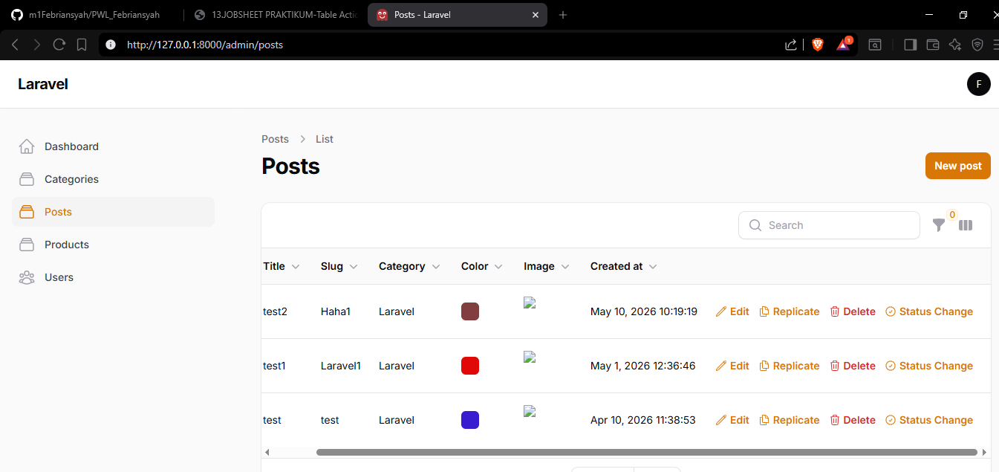
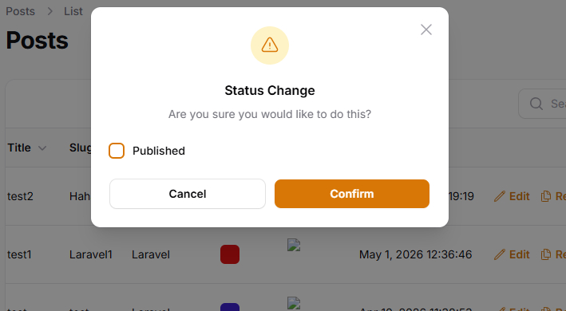
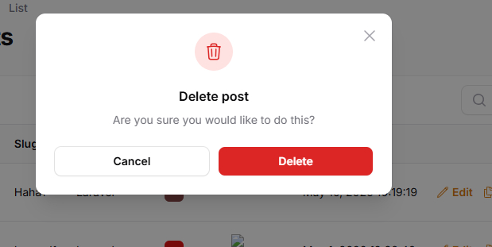
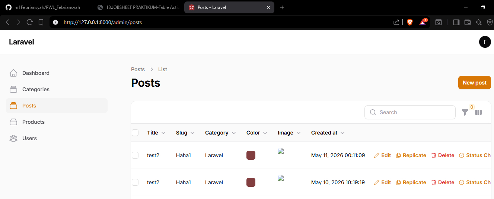

# Dokumentasi Jobsheet Pertemuan 13

Dokumentasi ini berisi rangkuman Jobsheet Pertemuan 13 pada project Filament App. Materi mencakup implementasi Table Actions, penggunaan predefined actions (Edit, Delete, Replicate), serta pembuatan custom action untuk mengupdate data langsung dari tabel tanpa masuk ke halaman edit.

- Nama: Muhammad Febriansyah
- NIM: 244107020199
- Kelas: TI-2F
- Mata Kuliah: Pemrograman Web Lanjut

## Struktur Materi

---

## Jobsheet 13 - Implementasi Table Actions & Custom Action di Filament

Pada tahap ini dipelajari cara menambahkan berbagai aksi pada tabel Filament untuk meningkatkan efisiensi manajemen data, tanpa perlu masuk ke halaman edit untuk setiap operasi.

### Langkah-Langkah Implementasi

#### 1. Menambahkan Delete Action

Delete action memungkinkan penghapusan data langsung dari tabel dengan konfirmasi dialog.

```php
->actions([
    Tables\Actions\EditAction::make()
        ->icon('heroicon-o-pencil'),
    Tables\Actions\DeleteAction::make()
        ->icon('heroicon-o-trash'),
])
```

**Hasil:**
- Tombol Delete muncul di tabel
- Saat diklik muncul confirmation dialog
- Data terhapus tanpa masuk ke halaman edit

[Delete Action](img/13-1.jpg)

---

#### 2. Menambahkan Replicate Action

Replicate action untuk menyalin data record dan membuat record baru dengan data yang sama.

```php
Tables\Actions\ReplicateAction::make()
    ->icon('heroicon-o-document-duplicate'),
```

**Hasil:**
- Tombol Replicate muncul di tabel
- Saat diklik → record baru dibuat dengan data yang sama

[Replicate Action](img/13-2.jpg)

---

#### 3. Membuat Custom Action (Toggle Publish/Unpublish)

Custom action untuk mengubah status published langsung dari tabel dengan form modal.

```php
Tables\Actions\Action::make('status')
    ->label('Status Change')
    ->icon('heroicon-o-check-circle')
    ->form([
        Checkbox::make('published')
            ->default(fn($record): bool => $record->published),
    ])
    ->action(function ($record, $data) {
        $record->update(['published' => $data['published']]);
    })
    ->requiresConfirmation()
```

**Komponen Action:**
- **`Action::make('status')`** - Identitas unik action
- **`->label('Status Change')`** - Label pada tombol
- **`->icon('heroicon-o-check-circle')`** - Icon tombol
- **`->form([...])`** - Form input dalam modal (bukan schema)
- **`->default(fn($record): bool => $record->published)`** - Set nilai default checkbox
- **`->action(function ($record, $data) {...})`** - Logic untuk update data
- **`->requiresConfirmation()`** - Tambah konfirmasi sebelum eksekusi

[Custom Action](img/13-3.jpg)
[Custom Action Pop up](img/13-2a.jpg)
---

#### 4. Daftar Predefined Actions di Filament

| Action | Fungsi |
|--------|--------|
| Create | Membuat data |
| Edit | Mengedit data |
| View | Melihat detail |
| Delete | Menghapus data |
| Replicate | Menyalin data |
| ForceDelete | Hapus permanen |
| Restore | Restore data soft delete |
| Import | Import data |
| Export | Export data |

---

#### 5. Fitur Tambahan Action

Filament menyediakan berbagai fitur tambahan untuk menyesuaikan action:

```php
->requiresConfirmation()      // Tambah konfirmasi dialog
->color('danger')             // Ubah warna tombol
->visible(fn($record) => ...)  // Tampil berdasarkan kondisi
->url(fn($record) => ...)      // Redirect ke halaman lain
->openUrlInNewTab()           // Buka di tab baru
```

---

### Analisis dan Diskusi

#### 1. Mengapa action di tabel lebih efisien dibanding halaman edit?

**Jawaban:** 
- Mengurangi klik navigasi user (tidak perlu masuk/keluar halaman edit)
- Operasi cepat untuk aksi sederhana seperti delete atau toggle status
- Meningkatkan produktivitas admin dalam manajemen data bulk
- User experience lebih smooth tanpa page reload

#### 2. Apa perbedaan predefined action dan custom action?

**Jawaban:**
- **Predefined Action**: Built-in action dari Filament (Edit, Delete, Replicate) yang sudah memiliki logika default dan tidak perlu konfigurasi lengkap
- **Custom Action**: Action yang dibuat sendiri dengan logika custom, form custom, dan callback function khusus sesuai kebutuhan bisnis

#### 3. Bagaimana cara menambahkan validasi dalam custom action?

**Jawaban:**
```php
->form([
    Checkbox::make('published')
        ->required()
        ->default(fn($record): bool => $record->published),
])
```
Validasi ditambahkan langsung pada field dalam form() menggunakan method seperti `->required()`, `->min()`, `->max()`, dll.

#### 4. Kapan kita menggunakan Replicate?

**Jawaban:**
- Saat perlu membuat data template yang sama berkali-kali (misal: membuat post baru dari post lama)
- Menghemat waktu input data yang redundan
- Cocok untuk form kompleks dengan banyak field yang sama

---

### Hasil Percobaan

#### Screenshot 1: Tampilan Tabel dengan Semua Actions


*Penjelasan: Tabel Posts menampilkan 4 tombol action untuk setiap baris:*
- ✏️ **Edit** - untuk mengedit data
- 📄 **Replicate** - untuk copy data
- 🗑️ **Delete** - untuk hapus data
- ✓ **Status Change** - untuk toggle publish/unpublish

---

#### Screenshot 2: Modal Form Status Change


*Penjelasan: Saat tombol "Status Change" diklik, muncul modal dengan checkbox untuk mengubah status published.*

---

#### Screenshot 3: Konfirmasi Dialog Delete


*Penjelasan: Saat tombol Delete diklik, muncul dialog konfirmasi untuk memastikan penghapusan data.*

---

#### Screenshot 4: Proses Replicate


*Penjelasan: Setelah klik Replicate, record baru dibuat dengan data yang sama dari record yang di-replicate.*

---

### Kesimpulan

Pada pertemuan ini telah dipelajari implementasi Table Actions di Filament yang mencakup:

1. **Predefined Actions**: Edit, Delete, Replicate yang siap pakai
2. **Custom Action**: Action custom dengan form input dan callback function
3. **Data Update Langsung**: Update data dari tabel tanpa halaman edit
4. **Icon & Label**: Customisasi tampilan action dengan icon berbeda
5. **Konfirmasi Dialog**: Menambah keamanan operasi dengan `requiresConfirmation()`

Fitur Table Actions sangat penting untuk meningkatkan efisiensi manajemen data di admin panel Filament, memberikan user experience yang lebih smooth, dan mengurangi waktu navigasi dalam operasi data sehari-hari.

---

**Sumber Referensi:**
- Filament Documentation: https://filamentphp.com/docs/3.x
- Jobsheet Pertemuan 13: Implementasi Table Actions & Custom Action di Filament
