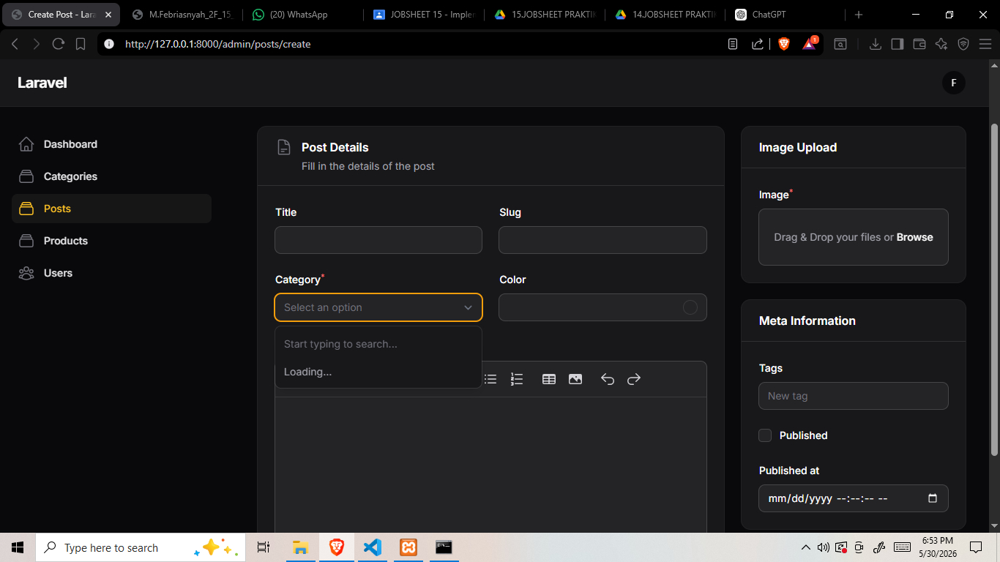
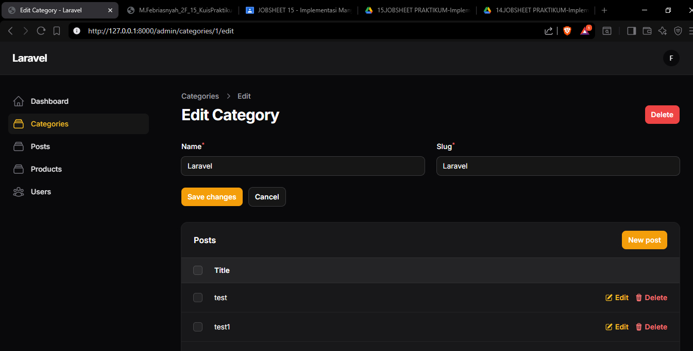
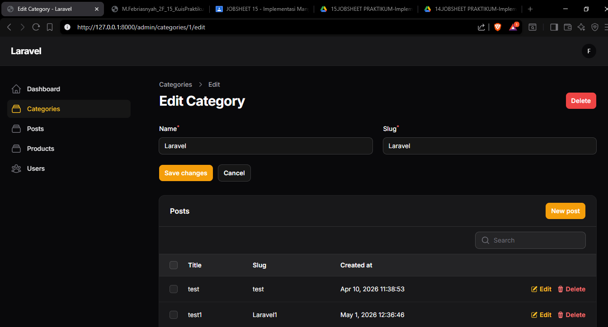
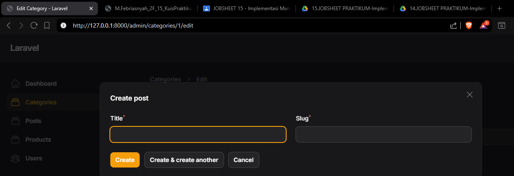

# Dokumentasi Jobsheet Pertemuan 14

Dokumentasi ini berisi rangkuman Jobsheet Pertemuan 14 pada project Filament App. Materi mencakup implementasi relasi HasMany dan BelongsTo pada Laravel, penggunaan method relationship() pada form Filament, implementasi dropdown relationship yang searchable, serta pembuatan Relationship Manager untuk mengelola data relasi langsung dari Filament Admin Panel.

- Nama: Muhammad Febriansyah
- NIM: 244107020199
- Kelas: TI-2F
- Mata Kuliah: Pemrograman Web Lanjut

## Struktur Materi

---

## Jobsheet 14 - Implementasi Relationship pada Filament (HasMany)

Pada tahap ini dipelajari cara membuat dan mengelola relationship antara model Category dan Post menggunakan fitur-fitur Filament untuk meningkatkan efisiensi CRUD relasi data.

### Langkah-Langkah Implementasi

#### 1. Relasi Category dan Post pada Database

Struktur database sederhana untuk relasi Category → HasMany → Post:

**Tabel Categories:**
```
id
name
slug
created_at
updated_at
```

**Tabel Posts:**
```
id
title
slug
category_id (foreign key)
color
image
body
tags
published
published_at
created_at
updated_at
```

**Relasi:**
- **Category** → `HasMany` → **Post**
- **Post** → `BelongsTo` → **Category**

---

#### 2. Implementasi Relationship pada Model

Tambahkan method relationship pada model Post:

**File: app/Models/Post.php**
```php
public function category()
{
    return $this->belongsTo(Category::class);
}
```

Tambahkan method relationship pada model Category:

**File: app/Models/Category.php**
```php
public function posts()
{
    return $this->hasMany(Post::class);
}
```

---

#### 3. Implementasi Relationship pada Form Filament

Tambahkan dropdown category pada Post Form dengan relationship:

**File: app/Filament/Admin/Resources/Posts/Schemas/PostForm.php**
```php
Select::make('category_id')
    ->relationship('category', 'name')
    ->options(Category::all()->pluck('name', 'id'))
    ->required()
    // ->preload()
    ->searchable(),
```

**Penjelasan Parameter:**
- **`'category'`** - nama relasi pada model Post
- **`'name'`** - field yang ditampilkan pada dropdown
- **`->options()`** - opsi dropdown dari data kategori
- **`->required()`** - field wajib diisi
- **`->preload()`** - preload semua data (bisa di-comment untuk dataset besar)
- **`->searchable()`** - tambahkan fitur pencarian pada dropdown

[Dropdown Kategori di Form Post](img/14-1.jpg)

---

#### 4. Membuat Dropdown Searchable (Untuk Dataset Besar)

Untuk dataset dengan banyak kategori, gunakan fitur searchable tanpa preload:

```php
Select::make('category_id')
    ->relationship('category', 'name')
    ->searchable()
    ->required()
```

[Dropdown Searchable](img/14-2.jpg)

---

#### 5. Menampilkan Data Relasi pada Tabel

Tampilkan nama kategori pada Post Table menggunakan dot notation:

**File: app/Filament/Admin/Resources/PostResource.php**
```php
public static function table(Table $table): Table
{
    return $table
        ->columns([
            TextColumn::make('title'),
            TextColumn::make('slug'),
            TextColumn::make('category.name')  // Tampilkan kategori
                ->searchable()
                ->sortable(),
            TextColumn::make('created_at')
                ->dateTime(),
        ])
```

**Hasil:**
| Title | Slug | Category | Created At |
|-------|------|----------|-----------|
| Post Laravel | post-laravel | Laravel | 2025-01-01 |
| Post PHP | post-php | PHP | 2025-01-02 |

[Tabel dengan Kategori](img/14-3.jpg)

---

#### 6. Membuat Relationship Manager

Relationship Manager memungkinkan mengelola data relasi langsung dari resource tanpa perlu berpindah halaman.

**Jalankan Command:**
```bash
php artisan make:filament-relation-manager CategoryResource posts title
```

**Parameter:**
- **`CategoryResource`** - Resource tempat relation manager ditambahkan
- **`posts`** - Nama relasi pada model Category
- **`title`** - Kolom yang ditampilkan sebagai title

**File yang Dibuat:**
```
CategoryResource/
└── RelationManagers/
    └── PostsRelationManager.php
```

---

#### 7. Konfigurasi Relationship Manager

**File: app/Filament/Admin/Resources/CategoryResource/RelationManagers/PostsRelationManager.php**

Tambahkan kolom pada form:
```php
public function form(Schema $schema): Schema
{
    return $schema
        ->schema([
            TextInput::make('title')
                ->required()
                ->maxLength(255),
            TextInput::make('slug')
                ->required()
                ->maxLength(255),
        ]);
}
```

Tambahkan kolom pada tabel:
```php
public function table(Table $table): Table
{
    return $table
        ->recordTitleAttribute('title')
        ->columns([
            TextColumn::make('title')
                ->searchable(),
            TextColumn::make('slug')
                ->searchable(),
            TextColumn::make('created_at')
                ->dateTime(),
        ])
        ->filters([
            // 
        ])
        ->headerActions([
            Tables\Actions\CreateAction::make(),
        ])
        ->actions([
            Tables\Actions\EditAction::make(),
            Tables\Actions\DeleteAction::make(),
        ])
        ->bulkActions([
            Tables\Actions\BulkActionGroup::make([
                Tables\Actions\DeleteBulkAction::make(),
            ]),
        ]);
}
```

---

#### 8. Menghubungkan Relationship Manager ke Resource

Tambahkan PostsRelationManager pada method `getRelations()` di CategoryResource:

**File: app/Filament/Admin/Resources/CategoryResource.php**
```php
<?php

namespace App\Filament\Admin\Resources;

use App\Filament\Admin\Resources\CategoryResource\Pages;
use App\Filament\Admin\Resources\CategoryResource\RelationManagers;
use App\Filament\Admin\Resources\CategoryResource\RelationManagers\PostsRelationManager;
use App\Models\Category;
use Filament\Forms;
use Filament\Resources\Resource;
use Filament\Tables;

class CategoryResource extends Resource
{
    protected static ?string $model = Category::class;

    public static function form(Form $form): Form
    {
        return $form->schema([
            TextInput::make('name')->required(),
            TextInput::make('slug')->required(),
        ]);
    }

    public static function table(Table $table): Table
    {
        return $table->columns([
            TextColumn::make('name'),
            TextColumn::make('slug'),
        ]);
    }

    public static function getRelations(): array
    {
        return [
            PostsRelationManager::class,
        ];
    }

    public static function getPages(): array
    {
        return [
            'index' => Pages\ListCategories::route('/'),
            'create' => Pages\CreateCategory::route('/create'),
            'edit' => Pages\EditCategory::route('/{record}/edit'),
        ];
    }
}
```

---

#### 9. Tambahkan Relasi pada Model Category

**File: app/Models/Category.php**
```php
<?php

namespace App\Models;

use Illuminate\Database\Eloquent\Model;

class Category extends Model
{
    protected $fillable = [
        'name',
        'slug'
    ];

    public function posts()
    {
        return $this->hasMany(Post::class);
    }
}
```

---

### Analisis dan Diskusi

#### 1. Apa perbedaan relationship() dengan options()?

**Jawaban:**
- **`relationship()`** - Menggunakan Eloquent relationship yang sudah didefinisikan di model. Lebih fleksibel dan otomatis handle update relasi.
  ```php
  Select::make('category_id')
      ->relationship('category', 'name')  // Pakai relationship
      ->searchable();
  ```

- **`options()`** - Manual define pilihan dari query builder atau collection. Perlu update manual pada controller action.
  ```php
  Select::make('category_id')
      ->options(Category::all()->pluck('name', 'id'))  // Manual query
      ->required();
  ```

**Kapan menggunakan:**
- Gunakan `relationship()` untuk relasi standard (BelongsTo, HasMany, BelongsToMany)
- Gunakan `options()` untuk data yang tidak punya relationship atau custom data

---

#### 2. Mengapa searchable() penting untuk dataset besar?

**Jawaban:**
-  **Performance**: Tidak perlu load semua 1000+ kategori langsung
-  **User Experience**: User bisa langsung cari kategori yang diinginkan
-  **Query Efficiency**: Hanya fetch data yang dicari, bukan semua data
-  **Memory Optimization**: Menghemat memory browser tidak load item besar

**Contoh Perbedaan:**

Tanpa `searchable()` (1000 kategori):
```php
Select::make('category_id')
    ->options(Category::all()->pluck('name', 'id'))
    //  Load 1000 item langsung
```

Dengan `searchable()`:
```php
Select::make('category_id')
    ->relationship('category', 'name')
    ->searchable()
    // Load 20 item, fetch lebih banyak saat user search
```

---

#### 3. Apa fungsi Relationship Manager pada Filament?

**Jawaban:**
Relationship Manager memungkinkan:

1. **CRUD Relasi Langsung** - Create, Read, Update, Delete data relasi tanpa pindah halaman
2. **Autofill Foreign Key** - category_id otomatis terisi saat membuat post dari category
3. **Unified Interface** - Semua operasi dalam satu resource page
4. **Better UX** - Tidak perlu navigasi antar halaman untuk manajemen relasi

**Contoh Kasus:**
- Admin membuka Edit Category "Laravel"
- Di tab bawah ada table Posts dengan button "New Post"
- Admin klik "New Post", form muncul
- Admin isi title & slug
- Saat save, category_id otomatis terisi dengan ID category "Laravel"
- Post berhasil dibuat tanpa admin perlu pilih kategori lagi

---

#### 4. Kapan menggunakan HasMany dan BelongsTo?

**Jawaban:**

**HasMany** - Digunakan pada side "one" (yang punya banyak):
```php
// Category model
public function posts()
{
    return $this->hasMany(Post::class);
}
// Satu category bisa punya banyak posts
```

**BelongsTo** - Digunakan pada side "many" (yang dimiliki):
```php
// Post model
public function category()
{
    return $this->belongsTo(Category::class);
}
// Satu post hanya punya satu category
```

**Relasi One-to-Many:**
```
Category (1) ──→ HasMany ──→ Posts (Many)
   ↑                              ↓
   └──────── BelongsTo ───────────┘
```

**Contoh Data Real:**
```
Category: Laravel
├── Post 1: Laravel Basics
├── Post 2: Laravel Routes
└── Post 3: Laravel Database

Category: PHP
├── Post 1: PHP Syntax
└── Post 2: PHP OOP
```

---

#### 5. Bagaimana cara handle soft delete pada Relationship Manager?

**Jawaban:**
Tambahkan pada RelationManager untuk show/restore soft deleted records:

```php
public function table(Table $table): Table
{
    return $table
        // ... columns & actions
        ->filters([
            Tables\Filters\TrashedFilter::make(),
        ])
        ->actions([
            Tables\Actions\EditAction::make(),
            Tables\Actions\DeleteAction::make(),
            Tables\Actions\RestoreAction::make(),
            Tables\Actions\ForceDeleteAction::make(),
        ]);
}
```

---

### Hasil Percobaan

#### Screenshot 1: Dropdown Category Searchable di Post Form


*Penjelasan: Dropdown kategori pada form Post menampilkan fitur pencarian. User bisa search kategori yang diinginkan tanpa harus scroll panjang.*

---

#### Screenshot 2: Tabel Post dengan Kolom Kategori


*Penjelasan: Kolom kategori ditampilkan menggunakan dot notation `category.name`, sehingga user bisa lihat kategori setiap post dalam satu tabel.*

---

#### Screenshot 3: Edit Category dengan Relationship Manager


*Penjelasan: Saat membuka Edit Category, tabel Posts berelasi ditampilkan di bawah. User bisa create, edit, atau delete posts langsung dari sini tanpa pindah halaman.*

---

#### Screenshot 4: Create Post dari Category


*Penjelasan: Saat klik "New Post" button, form modal muncul. Saat submit, category_id otomatis terisi dengan ID category yang sedang diedit.*

---

### Latihan Praktikum

Berdasarkan materi pertemuan 14, lakukan latihan berikut:

#### Tugas 1: Buat Relasi Category → Posts 
- [x] Buat migration untuk tabel categories dan posts
- [x] Buat model Category dan Post dengan relationship
- [x] Jalankan migration

**Verifikasi:**
```bash
php artisan migrate
```

---

#### Tugas 2: Implementasikan Dropdown Category pada Post Form 
- [x] Buka file PostForm.php atau PostResource.php
- [x] Tambahkan Select component untuk category_id
- [x] Gunakan method relationship() 
- [x] Set field yang ditampilkan ('name')

**Kode yang ditambahkan:**
```php
Select::make('category_id')
    ->relationship('category', 'name')
    ->required()
```

---

#### Tugas 3: Tambahkan Fitur Searchable pada Dropdown 
- [x] Pada dropdown category, tambahkan method `->searchable()`
- [x] Test dropdown bisa dicari

**Kode yang diupdate:**
```php
Select::make('category_id')
    ->relationship('category', 'name')
    ->searchable()
    ->required()
```

---

#### Tugas 4: Tampilkan Kategori pada Post Table 
- [x] Buka PostResource file table method
- [x] Tambahkan kolom baru untuk kategori
- [x] Gunakan dot notation `category.name`

**Kode yang ditambahkan:**
```php
TextColumn::make('category.name')
    ->searchable()
    ->sortable(),
```

---

#### Tugas 5: Buat Relationship Manager pada Category 
- [x] Jalankan command: `php artisan make:filament-relation-manager CategoryResource posts title`
- [x] File PostsRelationManager.php tercipta

**Command:**
```bash
php artisan make:filament-relation-manager CategoryResource posts title
```

---

#### Tugas 6: Hubungkan Relationship Manager ke CategoryResource 
- [x] Buka file CategoryResource.php
- [x] Import PostsRelationManager di bagian use statements
- [x] Tambahkan pada method `getRelations()`
- [x] Return array dengan PostsRelationManager::class

**Kode yang ditambahkan:**
```php
use App\Filament\Admin\Resources\CategoryResource\RelationManagers\PostsRelationManager;

public static function getRelations(): array
{
    return [
        PostsRelationManager::class,
    ];
}
```

---

#### Tugas 7: Tambahkan Kolom pada Relationship Manager Table
- [x] Buka PostsRelationManager.php
- [x] Pada method table(), tambahkan kolom untuk title, slug, created_at
- [x] Kustomisasi searchable dan sortable jika perlu

**Kode yang ditambahkan:**
```php
TextColumn::make('title')
    ->searchable()
    ->sortable(),
TextColumn::make('slug')
    ->searchable(),
TextColumn::make('created_at')
    ->dateTime(),
```

---

#### Tugas 8: Implementasi Model Relationship
- [x] Buka model Post.php, verify relasi `category()` sudah ada
- [x] Buka model Category.php, verify relasi `posts()` sudah ada

**Post.php:**
```php
public function category()
{
    return $this->belongsTo(Category::class);
}
```

**Category.php:**
```php
public function posts()
{
    return $this->hasMany(Post::class);
}
```

---

### Screenshot yang Harus Dikumpulkan

Dokumentasikan hasil percobaan dengan screenshot berikut:

1. **Dropdown Kategori pada Post Form**
   - Tampilkan form create/edit post dengan dropdown kategori yang bisa dicari
   - File: `img/screenshot-dropdown-category.jpg`

2. **Tabel Post dengan Kolom Kategori**
   - Tampilkan tabel posts dengan kolom kategori yang terisi
   - File: `img/screenshot-post-table-category.jpg`

3. **Relationship Manager pada Category**
   - Tampilkan edit category dengan table posts di bawah
   - File: `img/screenshot-category-with-posts.jpg`

4. **Create Post dari Category**
   - Tampilkan modal create post yang muncul saat klik "New Post"
   - File: `img/screenshot-create-post-from-category.jpg`

5. **Associate Existing Posts**
   - Tampilkan fitur associate untuk menambah posts existing
   - File: `img/screenshot-associate-posts.jpg`

---

### Kesimpulan

Pada pertemuan 14 ini telah dipelajari implementasi Relationship pada Filament yang mencakup:

1. **Model Relationship**: Membuat HasMany dan BelongsTo relationship pada model Laravel
2. **Dropdown Relationship**: Menggunakan `relationship()` method untuk dropdown otomatis
3. **Searchable Feature**: Menambahkan `searchable()` untuk dropdown dengan dataset besar
4. **Relasi pada Tabel**: Menampilkan data relasi menggunakan dot notation
5. **Relationship Manager**: Membuat CRUD interface untuk mengelola data relasi
6. **Integration**: Menghubungkan Relationship Manager ke CategoryResource
7. **Auto Foreign Key**: Category_id otomatis terisi saat create post dari category

