# Jobsheet 4 - Eloquent ORM
## Mata Kuliah: Pemrograman Web Lanjut

Dokumentasi Praktikum Jobsheet 4 tentang **Eloquent ORM** pada Laravel. Jobsheet ini membahas penggunaan Eloquent ORM untuk operasi CRUD, fillable attribute, relationships, dan lainnya.

* **Nama:** Muhammad Febriansyah
* **NIM:** 244107020199
* **Kelas:** TI-2F

---

## Praktikum 1 - $fillable Property pada Model

Pada praktikum ini, kita menambahkan properti `$fillable` pada `UserModel` agar Eloquent mengetahui kolom mana saja yang boleh diisi secara mass assignment menggunakan method seperti `create()` atau `fill()`.

**Yang dilakukan:**
- Membuka file `app/Models/UserModel.php`
- Menambahkan properti `$fillable` yang berisi array kolom: `level_id`, `username`, `nama`, `password`
- Menjalankan aplikasi dan melihat hasilnya

**Penjelasan:**
`$fillable` berfungsi sebagai **whitelist** kolom yang diizinkan untuk mass assignment. Tanpa properti ini, Laravel akan melempar error `MassAssignmentException` saat kita mencoba menggunakan `UserModel::create([...])`. Ini adalah fitur keamanan bawaan Laravel untuk mencegah pengguna menyisipkan data ke kolom yang tidak seharusnya.

```php
protected $fillable = ['level_id', 'username', 'nama', 'password'];
```

### Hasil - Praktikum 1 Langkah 7 (P1L7)
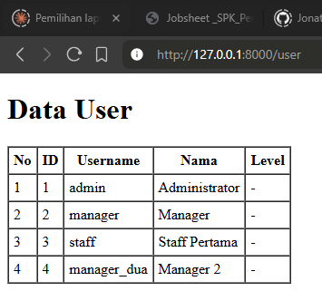

---

## Praktikum 2.1 - Retrieving Data (Menampilkan Data)

Pada praktikum ini, kita belajar cara mengambil data dari database menggunakan Eloquent ORM melalui controller dan menampilkannya di view.

**Yang dilakukan:**
- Membuat method `index()` pada `UserController` yang mengambil semua data user menggunakan `UserModel::all()`
- Mengirim data ke view `user.blade.php`
- Menampilkan data dalam bentuk tabel HTML

**Penjelasan:**
`UserModel::all()` adalah method Eloquent yang mengambil **semua record** dari tabel `m_user`. Data yang dikembalikan berupa Collection yang bisa di-loop menggunakan `@foreach` di Blade template. Data dikirim ke view melalui array parameter kedua pada `view()`.

```php
public function index()
{
    $user = UserModel::all();
    return view('user', ['data' => $user]);
}
```

### Hasil - Praktikum 2.1 Langkah 3 (P2.1L3)
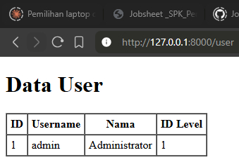

### Hasil - Praktikum 2.1 Langkah 5 (P2.1L5)
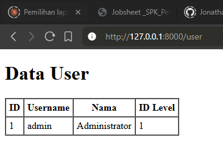

### Hasil - Praktikum 2.1 Langkah 7 (P2.1L7)
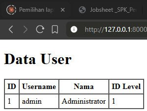

### Hasil - Praktikum 2.1 Langkah 9 (P2.1L9)
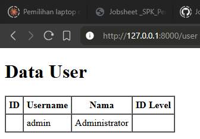

### Hasil - Praktikum 2.1 Langkah 11 (P2.1L11)


---

## Praktikum 2.2 - Menambah Data (Create) dengan Eloquent

Pada praktikum ini, kita belajar menambahkan data baru ke database menggunakan Eloquent ORM melalui method `create()`.

**Yang dilakukan:**
- Membuat method `tambah()` di `UserController` untuk menampilkan form tambah user
- Membuat view `user_tambah.blade.php` yang berisi form HTML dengan fields: username, nama, password, dan level_id
- Menambahkan route `GET /user/tambah` dan `POST /user/tambah_simpan`

**Penjelasan:**
Method `UserModel::create([...])` digunakan untuk menyimpan data baru ke database. Method ini memanfaatkan properti `$fillable` yang sudah didefinisikan di Praktikum 1. Password di-hash menggunakan `Hash::make()` agar tersimpan dalam bentuk terenkripsi di database. Setelah berhasil, user di-redirect kembali ke halaman daftar user.

```php
UserModel::create([
    'username' => $request->username,
    'nama' => $request->nama,
    'password' => Hash::make($request->password),
    'level_id' => $request->level_id,
]);
```

### Hasil - Praktikum 2.2 Langkah 2 (P2.2L2)
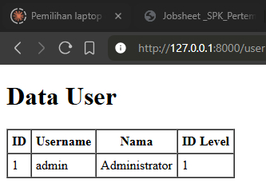

### Hasil - Praktikum 2.2 Langkah 5 (P2.2L5)
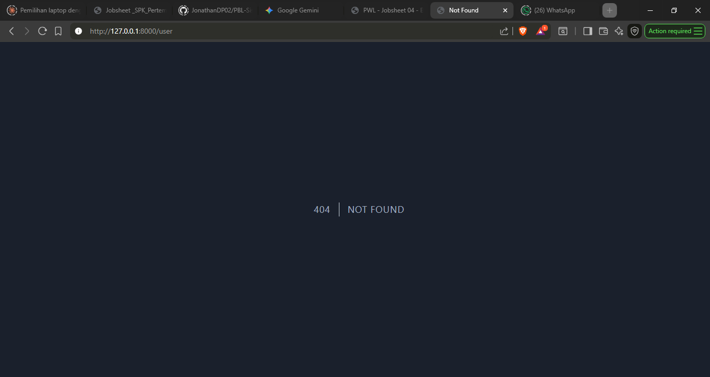

---

## Praktikum 2.3 - Menampilkan Detail Data (Find/Read)

Pada praktikum ini, kita belajar menampilkan detail data dari satu record tertentu berdasarkan primary key menggunakan Eloquent `find()`.

**Yang dilakukan:**
- Menggunakan method `find($id)` pada Eloquent model untuk mengambil satu record berdasarkan `user_id`

**Penjelasan:**
`UserModel::find($id)` mencari record berdasarkan primary key yang sudah didefinisikan di model (`user_id`). Method ini mengembalikan satu object model jika ditemukan, atau `null` jika tidak. Ini berbeda dengan `findOrFail()` yang akan melempar exception 404 jika data tidak ditemukan.

```php
$user = UserModel::find($id);
```

### Hasil - Praktikum 2.3 Langkah 5 (P2.3L5)
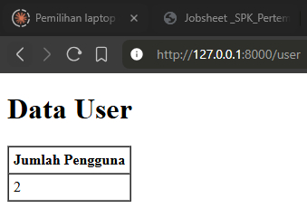

---

## Praktikum 2.4 - Mengubah Data (Update) dengan Eloquent

Pada praktikum ini, kita belajar mengubah data yang sudah ada di database menggunakan Eloquent ORM.

**Yang dilakukan:**
- Membuat method `ubah($id)` untuk menampilkan form edit yang sudah terisi data lama
- Membuat method `ubah_simpan($id, Request $request)` untuk menyimpan perubahan ke database
- Membuat view `user_ubah.blade.php` dengan form yang value-nya diisi dari data yang ada
- Menambahkan route `GET /user/ubah/{id}` dan `PUT /user/ubah_simpan/{id}`

**Penjelasan:**
Proses update dilakukan dengan cara: pertama ambil data menggunakan `find($id)`, lalu ubah atribut-atribut yang diinginkan satu per satu, dan terakhir panggil `save()` untuk menyimpan perubahan ke database. Method `save()` akan otomatis menjalankan query `UPDATE` karena model sudah ada di database.

```php
$user = UserModel::find($id);
$user->username = $request->username;
$user->nama = $request->nama;
$user->password = Hash::make($request->password);
$user->level_id = $request->level_id;
$user->save();
```

### Hasil - Praktikum 2.4 Langkah 3 (P2.4L3)
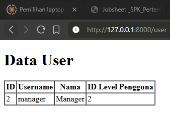

### Hasil - Praktikum 2.4 Langkah 5 (P2.4L5)
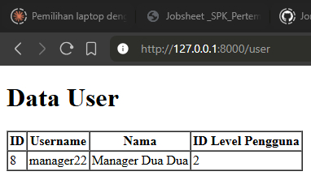

### Hasil - Praktikum 2.4 Langkah 9 (P2.4L9)
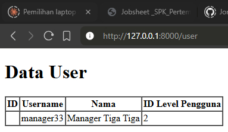

---

## Praktikum 2.5 - Menghapus Data (Delete) dengan Eloquent

Pada praktikum ini, kita belajar menghapus data dari database menggunakan Eloquent ORM.

**Yang dilakukan:**
- Membuat method `hapus($id)` di `UserController` yang mencari user berdasarkan ID lalu menghapusnya
- Menambahkan route `GET /user/hapus/{id}`
- Menambahkan link "Hapus" di view `user.blade.php`

**Penjelasan:**
Proses delete menggunakan method `delete()` pada instance model. Pertama data dicari menggunakan `find($id)`, kemudian method `delete()` dipanggil untuk menghapus record tersebut dari database. Setelah penghapusan berhasil, user di-redirect ke halaman daftar.

```php
$user = UserModel::find($id);
$user->delete();
return redirect('/user');
```

### Hasil - Praktikum 2.5 Langkah 2 (P2.5L2)
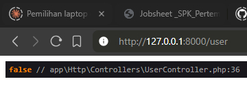

### Hasil - Praktikum 2.5 Langkah 4 (P2.5L4)
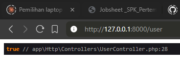

---

## Praktikum 2.6 - CRUD Lengkap (Tambah, Ubah, Hapus)

Pada praktikum ini, kita menggabungkan semua operasi CRUD menjadi satu alur lengkap dengan view yang saling terhubung.

**Yang dilakukan:**
- Menyatukan semua method CRUD di `UserController`: `index`, `tambah`, `tambah_simpan`, `ubah`, `ubah_simpan`, `hapus`
- Membuat view `user.blade.php` dengan tabel yang menampilkan semua data user beserta tombol aksi (Ubah & Hapus)
- Membuat view `user_tambah.blade.php` untuk form tambah data
- Membuat view `user_ubah.blade.php` untuk form edit data
- Mendaftarkan semua route yang dibutuhkan di `web.php`

**Penjelasan:**
Pada tahap ini, semua operasi CRUD sudah lengkap:
- **Create**: Form tambah → POST ke `tambah_simpan` → `UserModel::create()`
- **Read**: Halaman index → `UserModel::all()` → tampilkan di tabel
- **Update**: Form ubah → PUT ke `ubah_simpan` → `find()` lalu `save()`
- **Delete**: Link hapus → `find()` lalu `delete()`

Route yang didaftarkan:
```php
Route::get('/user', [UserController::class, 'index']);
Route::get('/user/tambah', [UserController::class, 'tambah']);
Route::post('/user/tambah_simpan', [UserController::class, 'tambah_simpan']);
Route::get('/user/ubah/{id}', [UserController::class, 'ubah']);
Route::post('/user/ubah_simpan/{id}', [UserController::class, 'ubah_simpan']);
Route::get('/user/hapus/{id}', [UserController::class, 'hapus']);
```

### Hasil - Praktikum 2.6 Langkah 3 (P2.6L3)
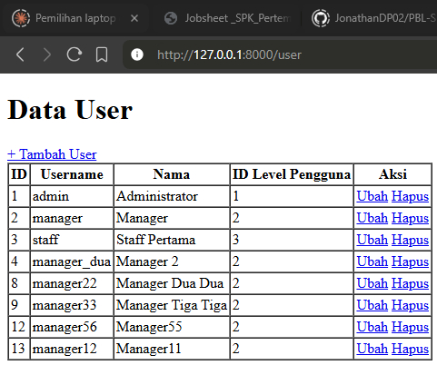

### Hasil - Praktikum 2.6 Langkah 7 (P2.6L7)
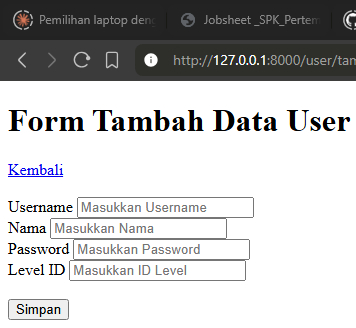

### Hasil - Praktikum 2.6 Langkah 13 (P2.6L13)
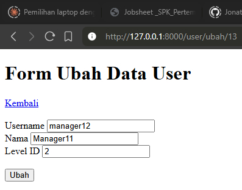

### Hasil - Praktikum 2.6 Langkah 20 (P2.6L20)
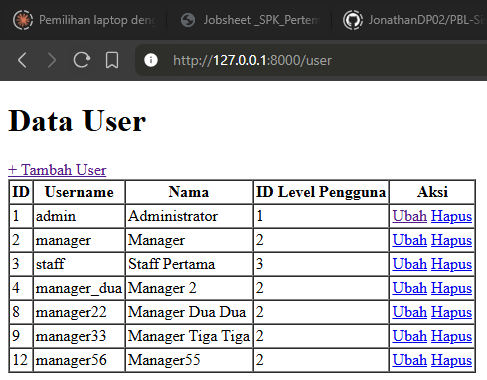

---

## Praktikum 2.7 - Relationships (Relasi antar Model)

Pada praktikum ini, kita belajar membuat relasi antar model menggunakan Eloquent Relationships, yaitu menghubungkan `UserModel` dengan `LevelModel`.

**Yang dilakukan:**
- Menambahkan method `level()` dengan relasi `belongsTo` di `UserModel` — setiap user **dimiliki oleh** satu level
- Menambahkan method `user()` dengan relasi `hasMany` di `LevelModel` — setiap level **memiliki banyak** user
- Mengubah query di `UserController@index` dari `UserModel::all()` menjadi `UserModel::with('level')->get()` untuk eager loading
- Mengubah view `user.blade.php` untuk menampilkan `level_kode` dan `level_nama` dari relasi

**Penjelasan:**
Eloquent Relationships memungkinkan kita mengakses data dari tabel lain yang berelasi tanpa menulis JOIN query secara manual.

- `belongsTo`: User **milik** satu Level. Didefinisikan di `UserModel` karena tabel `m_user` menyimpan foreign key `level_id`.
- `hasMany`: Level **punya banyak** User. Didefinisikan di `LevelModel` sebagai kebalikan dari `belongsTo`.
- `with('level')`: **Eager Loading** — memuat data relasi sekaligus dalam satu query untuk menghindari masalah N+1 query.

```php
// UserModel - belongsTo
public function level(): BelongsTo
{
    return $this->belongsTo(LevelModel::class, 'level_id', 'level_id');
}

// LevelModel - hasMany
public function user(): HasMany
{
    return $this->hasMany(UserModel::class, 'level_id', 'level_id');
}
```

Di view, data level diakses melalui relasi:
```php
{{ $d->level->level_kode }}
{{ $d->level->level_nama }}
```

### Hasil - Praktikum 2.7 Langkah 3 (P2.7L3)
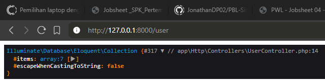

### Hasil - Praktikum 2.7 Langkah 5 (P2.7L5)
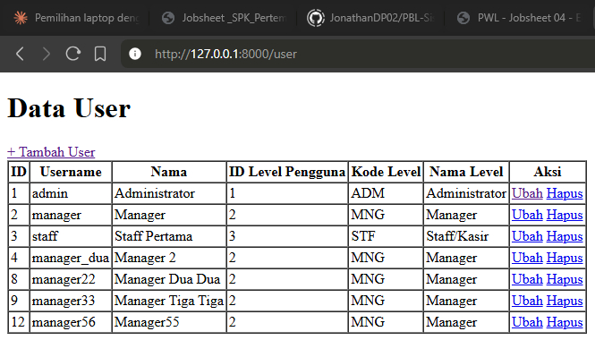