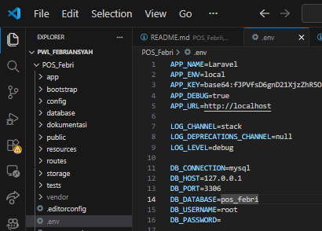
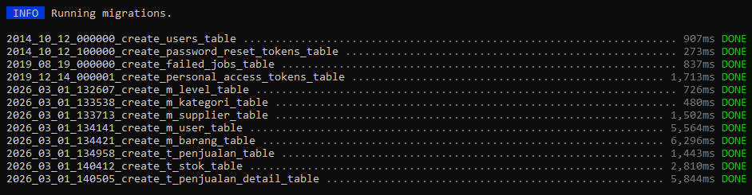
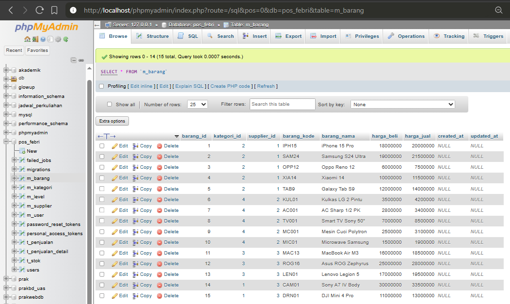
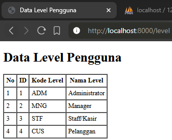
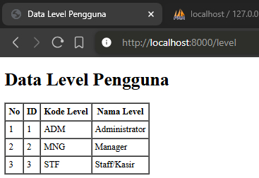
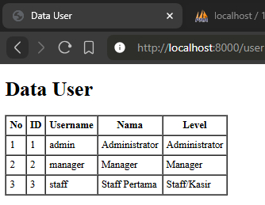

# Nama Proyek: Aplikasi POS (Point of Sales)
## Mata Kuliah: Pemrograman Web Lanjut
Ini adalah aplikasi web sederhana menggunakan **Laravel 11** untuk memenuhi Jobsheet 2.

* **Nama:** Muhammad Febriansyah
* **NIM:** 244107020199
* **Kelas:** TI-2F

## 1. Langkah 6 Praktikum 1
Berikut adalah hasil dari Praktikum 1 Langkah 6

## 2. Langkah 8 Praktikum 2
Berikut adalah hasil dari Praktikum 2 Langkah 8

## 3. Langkah 11 Praktikum 3
Berikut adalah hasil dari Praktikum 3 Langkah 11

## 4. Langkah 11 Praktikum 4
Berikut adalah hasil dari Praktikum 4 Langkah 11

## 5. Langkah 11 Praktikum 5
Berikut adalah hasil dari Praktikum 5 Langkah 11

## 6. Langkah 12 Praktikum 6
Berikut adalah hasil dari Praktikum 6 Langkah 12

## Soal Penutup 

1. Pada Praktikum 1 - Tahap 5, apakah fungsi dari APP_KEY pada file setting .env Laravel?
2. Pada Praktikum 1, bagaimana kita men-generate nilai untuk APP_KEY?
3. Pada Praktikum 2.1 - Tahap 1, secara default Laravel memiliki berapa file migrasi?
dan untuk apa saja file migrasi tersebut?
4. Secara default, file migrasi terdapat kode $table->timestamps();, apa tujuan/output
dari fungsi tersebut?
5. Pada File Migrasi, terdapat fungsi $table->id(); Tipe data apa yang dihasilkan dari
fungsi tersebut?
6. Apa bedanya hasil migrasi pada table m_level, antara menggunakan $table->id();
dengan menggunakan $table->id('level_id'); ?
7. Pada migration, Fungsi ->unique() digunakan untuk apa?
8. Pada Praktikum 2.2 - Tahap 2, kenapa kolom level_id pada tabel m_user
menggunakan $tabel->unsignedBigInteger('level_id'), sedangkan kolom level_id
pada tabel m_level menggunakan $tabel->id('level_id') ?
9. Pada Praktikum 3 - Tahap 6, apa tujuan dari Class Hash? dan apa maksud dari kode
program Hash::make('1234');?
10. Pada Praktikum 4 - Tahap 3/5/7, pada query builder terdapat tanda tanya (?), apa
kegunaan dari tanda tanya (?) tersebut?
11. Pada Praktikum 6 - Tahap 3, apa tujuan penulisan kode protected $table =
‘m_user’; dan protected $primaryKey = ‘user_id’; ?
12. Menurut kalian, lebih mudah menggunakan mana dalam melakukan operasi CRUD ke
database (DB Façade / Query Builder / Eloquent ORM) ? jelaskan

## Jawaban

1. APP_KEY digunakan untuk mengenkripsi data aplikasi, seperti cookie, sesi (session), dan data sensitif lainnya agar tetap aman. Jika kunci ini tidak ada, data yang dienkripsi tidak akan aman dan Laravel akan menampilkan error.
2. Dengan menjalankan perintah php artisan key:generate
3. Secara default (pada versi terbaru), Laravel memiliki 4 file migrasi:
   create_users_table: Untuk menyimpan data pengguna.
   create_password_reset_tokens_table: Untuk menyimpan token pemulihan kata sandi.
   create_failed_jobs_table: Untuk mencatat antrean (queue) pekerjaan yang gagal.
   create_personal_access_tokens_table: Untuk manajemen token API (Sanctum).
4. Fungsi ini secara otomatis menghasilkan dua kolom di tabel database, yaitu created_at (mencatat waktu data dibuat) dan updated_at (mencatat waktu data terakhir kali diubah).
5. Fungsi ini menghasilkan tipe data Big Integer yang bersifat Auto-Increment dan merupakan Primary Key.
6. $table->id(); akan membuat kolom primary key dengan nama default yaitu id. $table->id('level_id'); akan membuat kolom primary key dengan nama kustom yaitu level_id.
7. Digunakan untuk memastikan bahwa data dalam kolom tersebut tidak boleh ada yang sama (duplikat). Contohnya pada kolom username atau email.
8. Pada m_level, $table->id('level_id') digunakan karena kolom tersebut adalah Primary Key (pemberi identitas utama). Pada m_user, $table->unsignedBigInteger('level_id') digunakan karena kolom tersebut adalah Foreign Key (kunci tamu) yang hanya bertugas menampung ID dari tabel level agar bisa saling terhubung.
9. Class Hash digunakan untuk keamanan data sensitif. Hash::make('1234'); berfungsi untuk mengubah teks biasa "1234" menjadi kode acak yang tidak bisa dibaca (hashing), sehingga jika database bocor, password user tetap aman.
10. Tanda tanya tersebut adalah Placeholders (Parameter Binding). Gunanya untuk keamanan guna mencegah serangan SQL Injection, di mana inputan user dibersihkan terlebih dahulu sebelum masuk ke database.
11. protected $table = 'm_user';: Memberitahu Laravel bahwa model ini harus merujuk ke tabel m_user (karena secara default Laravel mencari nama jamak  seperti users).
    protected $primaryKey = 'user_id';: Memberitahu Laravel bahwa kunci utama tabel ini adalah user_id (karena secara default Laravel mencari kolom bernama id).
12. Eloquent ORM lebih mudah.Alasannya: Eloquent menggunakan sintaks yang sangat mirip dengan bahasa manusia (objek), kodenya lebih singkat, dan secara otomatis menangani relasi antar tabel tanpa kita harus menulis join SQL yang rumit.