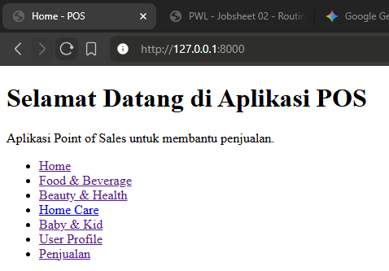
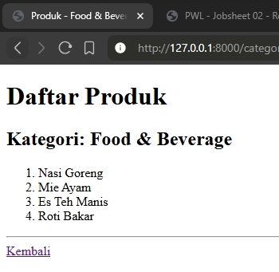
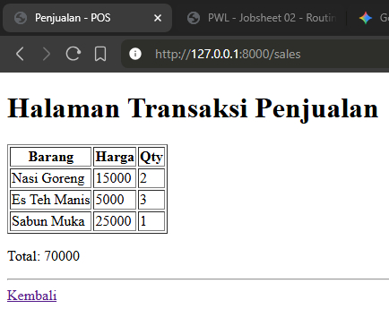

# Nama Proyek: Aplikasi POS (Point of Sales)
## Mata Kuliah: Pemrograman Web Lanjut
Ini adalah aplikasi web sederhana menggunakan **Laravel 11** untuk memenuhi tugas Praktikum 2.

* **Nama:** Muhammad Febriansyah
* **NIM:** 244107020199
* **Kelas:** TI-2F

## 1. Halaman Utama 

## 2. Daftar Produk

## 3. Halaman Transaksi

